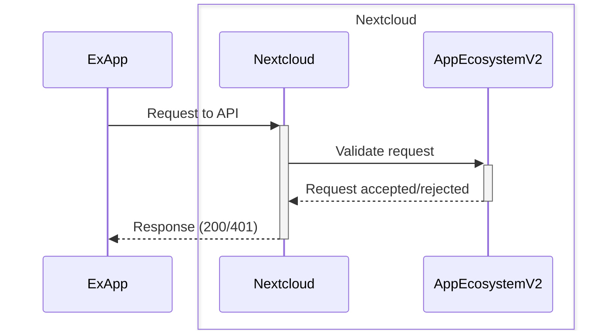

[](https://github.com/cloud-py-api/app_ecosystem_v2/actions/workflows/tests-deploy.yml)
[](https://github.com/cloud-py-api/app_ecosystem_v2/actions/workflows/tests.yml)
[](https://cloud-py-api.github.io/app_ecosystem_v2/)

# Nextcloud App Ecosystem V2

Nextcloud App Ecosystem V2 provides a new API for external apps on different programming languages

| Currently in a prototyping stage

Docs can be found [here](https://cloud-py-api.github.io/app_ecosystem_v2/).

## Dev changes to Nextcloud

`base.php` adjustment for authentication of Ex apps ([patch](./base_php.patch)).

```php
protected static function tryAppEcosystemV2Login(OCP\IRequest $request): bool {
	$appManager = Server::get(OCP\App\IAppManager::class);
	if (!$request->getHeader('AE-SIGNATURE')) {
		return false;
	}
	if (!$appManager->isInstalled('app_ecosystem_v2')) {
		return false;
	}
	$appEcosystemV2Service = Server::get(OCA\AppEcosystemV2\Service\AppEcosystemV2Service::class);
	return $appEcosystemV2Service->validateExAppRequestToNC($request);
}

```
`base.php - handleLogin`

```php
if (self::tryAppEcosystemV2Login($request)) {
	return true;
}
```

## Authentication diagram

AppEcosystemV2 adds separate authentication for external apps. 
This authentication is based on a shared secret between Nextcloud and the external app.

### Overview of the authentication process

1. ExApp sends a request to Nextcloud
2. Nextcloud passes request to AppEcosystemV2
3. AppEcosystemV2 validates request
4. Request is accepted/rejected



More details in [docs](https://cloud-py-api.github.io/app_ecosystem_v2/authentication.html)

## 🔧 Configuration

### Admin settings

In Admin section you can configure existing external apps.
