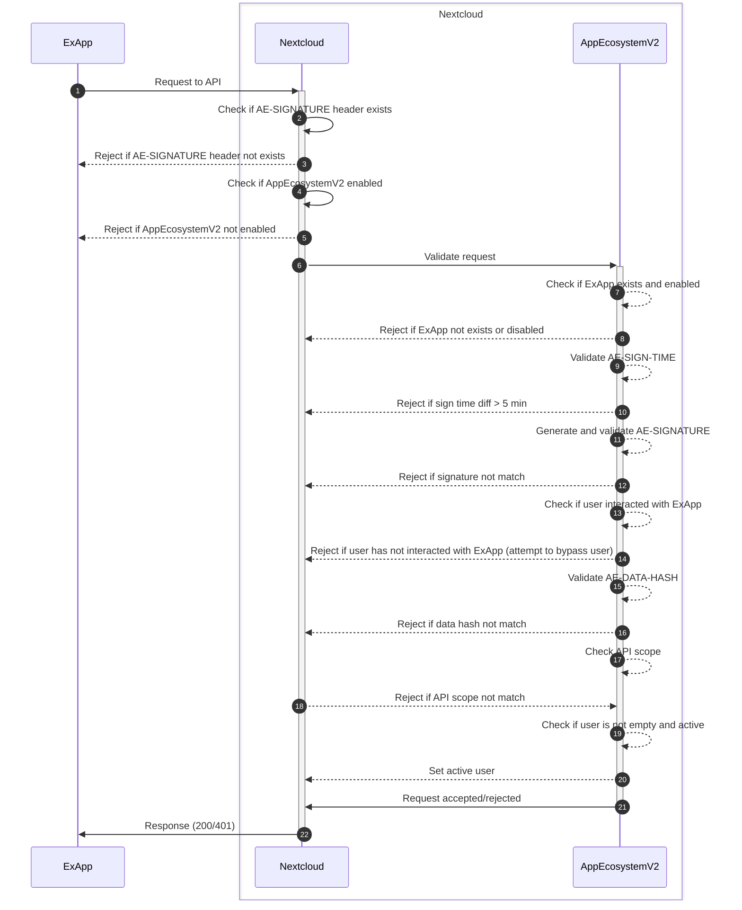

# Nextcloud App Ecosystem V2

Nextcloud App Ecosystem V2 provides a new API for external apps on different programming languages

| Currently in a prototyping stage

## Dev changes to Nextcloud

`base.php` adjustment for authentication of Ex apps.

```php
protected static function tryAppEcosystemV2Login(OCP\IRequest $request): bool {
	$appManager = Server::get(OCP\App\IAppManager::class);
	if (!$request->getHeader('AE-SIGNATURE')) {
		return false;
	}
	if (!$appManager->isAppLoaded('app_ecosystem_v2')) {
		return false;
	}
	if (!$appManager->isInstalled('app_ecosystem_v2')) {
		return false;
	}
	$appEcosystemV2Service = Server::get(OCA\AppEcosystemV2\Service\AppEcosystemV2Service::class);
	return $appEcosystemV2Service->validateExAppRequestToNC($request);
}

```
`base.php - handleLogin`

```php
if (self::tryAppEcosystemV2Login($request)) {
	return true;
}
```

## Authentication diagram

AppEcosystemV2 adds separate authentication for external apps. 
This authentication is based on a shared secret between Nextcloud and the external app.

### Overview of the authentication process

1. ExApp sends a request to Nextcloud
2. Nextcloud passes request to AppEcosystemV2
3. AppEcosystemV2 validates request (see [validation](#AppEcosystemV2-validation) section)
4. Request is accepted/rejected


### AppEcosystemV2 validation

Each ExApp request to secured with AEAuth must contain the following headers (order is important):

1. `AE-VERSION` - `[required]` minimal version of the AppEcosystemV2
2. `EX-APP-ID` - `[required]` id of the ExApp
3. `EX-APP-VERSION` - `[required]` version of the ExApp
4. `NC-USER-ID` - `[optional]` the user under which the request is made, can be empty in case of system apps (more deatils in [scopes](#AppEcosystemV2-scopes) section)
5. `AE-DATA-HASH` - `[required]` hash of the request body (see details in [signature](#AE-SIGNATURE) section)
6. `AE-SIGN-TIME` - `[required]` unix timestamp of the request
7. `AE-SIGNATURE` - `[required]` signature of the request (see details [signature](#AE-SIGNATURE) section)

### AE-SIGNATURE

AppEcosystemV2 signature (AE-SIGNATURE) is a HMAC-SHA256 hash of the request signed with the shared secret.

Depending on request method signing body is different:

* `GET`
  * method
  * uri (with urlencoded query params)
  * headers (`AE-VERSION`, `EX-APP-ID`, `EX-APP-VERSION`, `NC-USER-ID`, `AE-DATA-HASH`, `AE-SIGN-TIME`)
* Others
  * method
  * uri (with urlencoded query params)
  * headers (`AE-VERSION`, `EX-APP-ID`, `EX-APP-VERSION`, `NC-USER-ID`, `AE-DATA-HASH`, `AE-SIGN-TIME`)
  * xxh64 hash from request body (post data, json, files, etc)

### AE-DATA-HASH signature

`AE-DATA-HASH` header must contain a xxh64 hash of the request body. 
It's calculated even if the request body is empty (e.g. empty hash: `ef46db3751d8e999`).

### AppEcosystemV2 scopes

AppEcosystemV2 supports the following default scopes:

* `INIT_API_SCOPE` - init scope, used when ExApp is on initialization step and has no user context
* `SYSTEM_API_SCOPE` - configured for system apps, has no user context

### AppEcosystemV2 validation diagram



## 🔧 Configuration

### Admin settings

In Admin section you can configure existing external apps.
